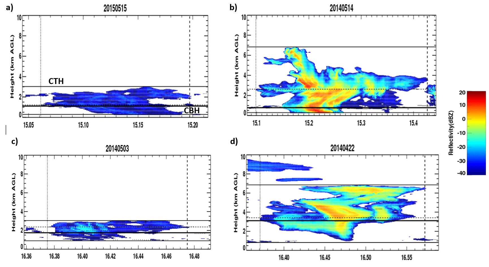

```{r setup, include=FALSE}
knitr::opts_chunk$set(echo = TRUE)

devtools::load_all("Reiss")
```

# Entrainment in Shallow Cumulus and Congestus During GoAmazon 2014/5

## 1. Introduction

Convective type clouds occur often near the equator. The Green Ocean Amazon (GoAmazon) 2014-2015 campaign included the deployment of several Atmospheric Radiation Measurement (ARM) instruments in Manacapuru, Brazil. This site was chosen due to its location close to the Intertropical Convergence Zone (ITCZ), making convective clouds and precipitation prevalent. The two types of convective clouds focused on in this study are shallow cumulus, with cloud top heights (CTH) between 0 and 4 km and cumulus congestus, with CTH between 4 and 9  km. The overarching goals of this project are to find the affects that precipitation has on the growth of each type of cloud and their entrainment (or lateral mixing of environmental air into the cloud) rates. Do entrainment rates (ER) vary across the two different convective cloud regimes? And do entrainment rates vary in different convective environments?  


## 2. Data and Methods

The GoAmazon campaign lasted from January 2014 through December 2015. The W-band ARM Cloud Radar (WACR), a radar with high sensitivity to small cloud particles, took continuous data of the vertical profile of clouds as they advected over the site. Using the WACR reflectivities and Doppler velocities, cloud properties, including cloud base heights (CBH), CTH, and vertical velocities can be found.  This cloud information will be used to separate each cloud observed into the correct regime. A distribution of the differenct CTH found in the campaign can be seen in Figure 1. Each regime and their determinant properties are listed in Table 1 and examples of radar images of each are plotted in Figure 2. A total of 787 clouds were identified during the campaign. Since almost all of the congestus clouds are precipitating, congestus clouds are not split into two regimes, but left as one: precipitating congestus. 
	
Radiosondes were launched four times per day at the site to quantify the vertical profile of the environmental thermodynamic variables, including relative humidity (RH). A simple "entraining plume" model uses the CTH and the thermodynamic sounding to estimate a bulk entrainment rate for each of the clouds in the study. This entrainment rate will then be used to find possible correlations with RH and cloud thickness. Plots and $R^2$ calculations will be shown to find possible correlations and compare the results of each regime. A student's t-test will also be done to see if the entrainment rate differences for each regime are significant. 


```{r data, echo=F}

# Import data
data(clouds)


CTHmax_s <- 4000.0
CTHmin_c <- 4000.0
CTHmax_c <- 9000.0
CBH_thresh <- 1000.0

# Classify clouds based on CTH
d <- Cloud_Classification(data = clouds, CTHmax_s, CTHmin_c, CTHmax_c) 
shallow_cloud <- d$shallow
congestus_cloud <-d$congestus


# Classify clouds based on CBH
s <- Precip_Classification(shallow_cloud, CBH_thresh)
shallow_precip <- s$precip
shallow_noprecip <- s$noprecip

c <- Precip_Classification(congestus_cloud, CBH_thresh)
congestus_precip <- c$precip
congestus_noprecip <- c$noprecip

```

```{r hist, echo=F, fig.cap="Figure 1: Histogram of the cloud top heights that occur during the campaign"}
hist(clouds$CTH/1000, xlab = "CTH (km)", main = "CTH Histogram", breaks = 100)
```



```{r table, echo=F}

shal_p <- nrow(shallow_precip)
shal_np <- nrow(shallow_noprecip)
cong_p <- nrow(congestus_precip)
cong_np <- nrow(congestus_noprecip)


shal <- c(paste("shallow, precip - ", shal_p), paste("shallow, no precip - ", shal_np))
cong <- c(paste("congestus, precip - ", cong_p), paste("congestus, no precip - ", cong_np))

#shal <- c("shallow, precip", "shallow, no precip")
#cong <- c("congestus, precip", "congestus, no precip")

rows <- c("CBH < 100m", "CBH > 100m")

newTable <- data.frame(shal=shal,
                       cong=cong)

row.names(newTable) <- c("CBH < 1000m", "CBH > 1000m")

knitr::kable(newTable,
             col.names = c("CTH 0-4km", "CTH 4-9km"),
             row.names = TRUE,
             caption = "Table 1: Convective cloud regimes and how many of each occur during the campaign")


```


## 3. Results

### a. ER dependencies on environment

```{r erct, echo=F, fig.cap="Figure 3: The entrainment rate versus the cloud thickness for shallow, non-precipitating clouds (black); shallow, precipitating clouds (red); and congestus clouds (green), along with their trend lines."}
label = c("Shallow- No Precip", "Shallow- Precip", "Congestus- Precip")
data <- list(shallow_noprecip, shallow_precip, congestus_cloud)
cols <- 1:3

Plot_func(data=data, varx=5, vary=1, cols=cols, label=label, xlab="Cloud Thickness (m)", ylab=expression(paste("ER (% km"^-1,")")), xlim=c(0,9000), ylim=c(0,200), main="ER vs Cloud Thickness")

serct <- Analyze(shallow_cloud$ER, shallow_cloud$depth)
cerct <- Analyze(congestus_cloud$ER, congestus_cloud$depth)

```

```{r errh, echo=F, fig.cap="Figure 4: The entrainment rate versus the relative humidity for shallow, non-precipitating clouds (black); shallow, precipitating clouds (red); and congestus clouds (green), along with their trend lines."}

Plot_func(data=data, varx=2, vary=1, cols=cols, label=label, xlab="RH (%)", ylab=expression(paste("ER (% km"^-1,")")), xlim=c(0,100), ylim=c(0,200), main="ER vs RH")

serrh <- Analyze(shallow_cloud$ER, shallow_cloud$RH)
cerrh <- Analyze(congestus_cloud$ER, congestus_cloud$RH)
```

The ER does not seem to have a high correlation with cloud thickness for shallow clouds, with the thickness only explaining `r round(serct, 4)*100`% of the variance in ER. However, ER has a stronger negative correlation with cloud thickness for congestus clouds, explaining `r round(cerct, 4)*100`% of ER variance. This is consistent with entrainment formulations which scale as ~1/H (H being cloud depth). Precipitation in shallow cumulus appears to slightly increase the entrainment rate relative to non-precipitating clouds (Figure 3). 

ER has a higher positive correlation with RH for shallow clouds, but the opposite relationship that we would expect from literature (@deRooy2013), which suggests a negative correlation. RH explains `r round(serrh, 4)*100`% of the variance. RH does not have as strong of a relationship with ER in congestus clouds, with a correlation of `r round(cerrh, 4)*100`% (Figure 4). Though there are some relationships between ER and cloud thickness and RH, these relationships are fairly weak. 

### b. ER across various regimes


```{r ercth, echo=F, fig.cap="Figure 5: The entrainment rate versus the cloud top height for shallow, non-precipitating clouds (black); shallow, precipitating clouds (red); and congestus clouds (green), along with their trend lines."}

Plot_func(data=data, varx=3, vary=1, cols=cols, label=label, xlab="CTH (m)", ylab=expression(paste("ER (% km"^-1,")")), xlim=c(0,9000), ylim=c(0,200), main="ER vs CTH") 

scp <- T_test(shallow_cloud$ER, congestus_cloud$ER)
snpp <- T_test(shallow_precip$ER, shallow_noprecip$ER) 

```

For shallow cumulus clouds, the ER does not seem to affect the CTH. However, for congestus, you need increasingly lower entrainment rates to form taller clouds (Figure 5). The mean entrainment rate for shallow cumulus is `r round(mean(shallow_cloud$ER), 1)` %$km^{-1}$, while the mean entrainment rate for congestus is `r round(mean(congestus_cloud$ER),1)` %$km^{-1}$. This difference is significant, according to the Student's t-test, which resulted in a p-value of $`r scp`$. The null hypothesis that the two means are equal can be rejected at the 95% confidence interval. 

The precipitation does not appear to cause much difference in the entrainment rates. The mean ER for shallow, non-precipitating clouds is `r round(mean(shallow_noprecip$ER), 1)` %$km^{-1}$ and the mean ER for shallow, precipitating clouds is slightly more, at `r round(mean(shallow_precip$ER) , 1)` %$km^{-1}$. This difference is not signficant and we cannot say that the two means are not equal, since the p-value is `r round(snpp,3)`. 

## 4. Discussion and Conclusions 

There are two shallow convective regimes in the tropics: shallow cumulus and cumulus congestus. One of the purposes of this study was to see if entrainment rates differed across the different convective regimes. By doing a Student's T-test, it was found that the mean ERs of each regime are statistically different from eachother. It takes lower entrainment rates to grow congestus clouds compared to shallow clouds. This information can be used to improve model parameterizations of entrainment.     

Entrainment in the clouds is an important factor controlling the lifecycle and macrophysical properties of the cloud. Understanding the environments that control the entrainment rate is essential to understanding cloud lifecylces and types and, therefore, being able to simulate them well in models. Though models use relative humidity as the controlling factor of entrainment rates, this study found a weak ER dependency on RH, especially for congestus clouds. The ER dependency on RH in models could be a reason models cannot accurately simulate cumulus clouds. Congestus had a stronger ER relationship with cloud thickness, which resembles other model calculations of ER.  

Due to the convergence in the tropics, these clouds are typically associated with precipitation. Another purpose of this study was to see if entrainment rates in precipitating clouds differed from those in non-precipitating clouds. Though the mean ER in precipitating clouds is slightly higher, the difference is not statistically significant. 

Future work on this project will include attempting to improve the method of entrainment calculations. These retrieved entrainment rates are smaller (factor of ~2) than Large Eddy Simulation (LES)(@Siebesma1995). Reasons for this could be from using the maximum CTH in calculations or using surface-based parcel properties. In the future, we could use average CTH and a lifting condensation level (LCL) based parcel. Other approaches of entrainment measurements have been proposed but not significantly applied. One of these methods is by Jensen in 2013, which is a buoyancy-based approach that uses vertical motion obtained from cloud radar. However, this method would not work for precipitating clouds due to its use of vertical air motions. 

## 5. References 


